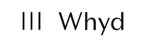

[](https://app.codacy.com/gh/openwhyd/openwhyd/dashboard?utm_source=gh&utm_medium=referral&utm_content=&utm_campaign=Badge_coverage) [](#backers) [](#contributors) [](docs/FAQ.md) [](https://facebook.com/groups/openwhyd/)

# Openwhyd

> 💎 Like Pinterest, but for Music. Discover, collect and play music from Youtube, Soundcloud, Bandcamp, Deezer and other streaming platforms.

Openwhyd is a music curation service freely available at [openwhyd.org](https://openwhyd.org). It was designed for music lovers who enjoy taking their time to find the best tracks and videos for their collection, including:

- music videos, bootlegs and specific live performances,
- fresh tracks from new and/or local artists,
- DJ sets and rare remixes,
- or any song that can be found and streamed online, and may not be found on Spotify, Apple Music or other music services.

[](https://www.youtube.com/watch?v=aZT8VlTV1YY 'Openwhyd Demo Video')

Initially known as "Whyd", the development of this product started in 2012. It became open-source in 2016. Read the full story [from Whyd to Openwhyd](https://medium.com/openwhyd/music-amongst-other-topics-a4f41657d6d).

## Features

- Playlists: made of tracks from **various sources**: Youtube, Soundcloud, Bandcamp, Deezer...
- Button: Add a track from **any web page**, in a few clicks, using our Google Chrome extension and bookmarklet
- Radio: **Subscribe** to music curators based on your musical taste, and listen to their latest discoveries
- Fame: Get a following by creating awesome playlists, and being featured in the "**Hot Tracks**" ranking
- Search: Add descriptions to your track, to make them **easier to find** when you need them
- Integration: Embed your playlists on your blog or website, so your visitors can listen to it directly.

👋 A question, a problem? Check out [our FAQ](docs/FAQ.md) and/or [chat with our community of music lovers](https://www.facebook.com/groups/openwhyd/).

## Development

### Tech stack

- Back-end: [Node.js](https://nodejs.org/) + [MongoDB](https://www.mongodb.com/) + [Express](https://expressjs.com/)
- Front-end: HTML + CSS + jQuery
- Streaming: [PlayemJS](https://github.com/adrienjoly/playemjs)

### Setup and usage

You just need Docker and `git` installed on your computer:

```sh
$ git clone https://github.com/openwhyd/openwhyd.git
$ cd openwhyd
$ docker compose up --build --detach
$ open http://localhost:8080
$ docker compose down --rmi local --remove-orphans # to stop the server and database + clean-up
```

More info about **Setup and Usage**: [INSTALL.md](docs/INSTALL.md).

<!-- If you want to run it directly with `docker compose`, checkout [Openwhyd on Docker Hub](https://hub.docker.com/r/openwhyd/openwhyd).

If you want to deploy Openwhyd to a server, you can follow our guide: [How to deploy on DigitalOcean](docs/howto-deploy-on-digitalocean.md). -->

🤗 The project is **open to contributions**. Check out [our FAQ](docs/FAQ.md#id-love-to-contribute-to-openwhyd-how-can-i-help) for more info.

## Contributors

These are the wonderful people whose time and sweat have made Openwhyd's heart beat since 2012! 💓 ([emoji key](https://github.com/kentcdodds/all-contributors#emoji-key)):

<!-- ALL-CONTRIBUTORS-LIST:START - Do not remove or modify this section -->
<!-- prettier-ignore-start -->
<!-- markdownlint-disable -->
<table>
  <tr>
    <td align="center"><a href="https://twitter.com/gillespoupardin"><br /><sub><b>Gilles Poupardin</b></sub></a><br /><a href="#talk" title="Talks">📢</a> <a href="#ideas" title="Ideas, Planning, & Feedback">🤔</a> <a href="#financial" title="Financial">💵</a></td>
    <td align="center"><a href="https://github.com/jiem"><br /><sub><b>Jie Meng-Gérard</b></sub></a><br /><a href="https://github.com/openwhyd/openwhyd/commits?author=jiem" title="Code">💻</a> <a href="#infra-jiem" title="Infrastructure (Hosting, Build-Tools, etc)">🚇</a> <a href="#financial-jiem" title="Financial">💵</a></td>
    <td align="center"><a href="https://adrienjoly.com/now"><br /><sub><b>Adrien Joly</b></sub></a><br /><a href="https://github.com/openwhyd/openwhyd/commits?author=adrienjoly" title="Code">💻</a> <a href="https://github.com/openwhyd/openwhyd/commits?author=adrienjoly" title="Documentation">📖</a> <a href="https://github.com/openwhyd/openwhyd/commits?author=adrienjoly" title="Tests">⚠️</a> <a href="#question-adrienjoly" title="Answering Questions">💬</a></td>
    <td align="center"><a href="https://github.com/loickm"><br /><sub><b>loickm</b></sub></a><br /><a href="#design-loickm" title="Design">🎨</a> <a href="https://github.com/openwhyd/openwhyd/commits?author=loickm" title="Code">💻</a></td>
    <td align="center"><a href="https://twitter.com/tonyhymes"><br /><sub><b>Tony Hymes</b></sub></a><br /><a href="#talk" title="Talks">📢</a> <a href="#blog" title="Blogposts">📝</a> <a href="#eventOrganizing" title="Event Organizing">📋</a> <a href="#question" title="Answering Questions">💬</a></td>
    <td align="center"><a href="http://www.choses.fr"><br /><sub><b>Damien Romito</b></sub></a><br /><a href="https://github.com/openwhyd/openwhyd/commits?author=damienromito" title="Code">💻</a> <a href="#plugin-damienromito" title="Plugin/utility libraries">🔌</a></td>
    <td align="center"><a href="http://www.camillebetinyani.com"><br /><sub><b>Camille Betinyani</b></sub></a><br /><a href="#design" title="Design">🎨</a></td>
  </tr>
  <tr>
    <td align="center"><a href="https://github.com/cmdcmdcmd"><br /><sub><b>Claire Marion</b></sub></a><br /><a href="#design-cmdcmdcmd" title="Design">🎨</a> <a href="#blog-cmdcmdcmd" title="Blogposts">📝</a> <a href="#ideas-cmdcmdcmd" title="Ideas, Planning, & Feedback">🤔</a></td>
    <td align="center"><a href="http://julientanay.com"><br /><sub><b>Julien Tanay</b></sub></a><br /><a href="#infra-Djiit" title="Infrastructure (Hosting, Build-Tools, etc)">🚇</a> <a href="#tool-Djiit" title="Tools">🔧</a> <a href="https://github.com/openwhyd/openwhyd/commits?author=Djiit" title="Code">💻</a></td>
    <td align="center"><a href="https://github.com/SkinyMonkey"><br /><sub><b>Adrien Candiotti</b></sub></a><br /><a href="#infra-SkinyMonkey" title="Infrastructure (Hosting, Build-Tools, etc)">🚇</a> <a href="https://github.com/openwhyd/openwhyd/commits?author=SkinyMonkey" title="Code">💻</a> <a href="#ideas-SkinyMonkey" title="Ideas, Planning, & Feedback">🤔</a></td>
    <td align="center"><a href="https://www.linkedin.com/in/constance-betinyani-30b8b95a/"><br /><sub><b>Constance Betinyani</b></sub></a><br /><a href="#blog" title="Blogposts">📝</a> <a href="#fundingFinding" title="Funding Finding">🔍</a></td>
    <td align="center"><a href="https://angel.co/alberto-fantappie"><br /><sub><b>Alberto Fantappie</b></sub></a><br /><a href="#fundingFinding" title="Funding Finding">🔍</a> <a href="#eventOrganizing" title="Event Organizing">📋</a></td>
    <td align="center"><a href="https://www.linkedin.com/in/mathildevercelletto/"><br /><sub><b>Mathilde Vercelletto</b></sub></a><br /><a href="https://github.com/openwhyd/openwhyd/commits?author=" title="Documentation">📖</a> <a href="#financial" title="Financial">💵</a></td>
    <td align="center"><a href="https://twitter.com/henrilieutaud"><br /><sub><b>Henri Lieutaud</b></sub></a><br /><a href="#ideas-ElBurritoPodrido" title="Ideas, Planning, & Feedback">🤔</a></td>
  </tr>
  <tr>
    <td align="center"><a href="https://github.com/FrancoisBurra"><br /><sub><b>François Burra</b></sub></a><br /><a href="#ideas-FrancoisBurra" title="Ideas, Planning, & Feedback">🤔</a></td>
    <td align="center"><a href="http://greyvugrin@github.io"><br /><sub><b>Grey Vugrin</b></sub></a><br /><a href="https://github.com/openwhyd/openwhyd/commits?author=greyvugrin" title="Code">💻</a> <a href="https://github.com/openwhyd/openwhyd/issues?q=author%3Agreyvugrin" title="Bug reports">🐛</a> <a href="#tool-greyvugrin" title="Tools">🔧</a></td>
    <td align="center"><a href="https://github.com/Marinlemaignan"><br /><sub><b>Marin le Maignan</b></sub></a><br /><a href="https://github.com/openwhyd/openwhyd/commits?author=Marinlemaignan" title="Code">💻</a> <a href="https://github.com/openwhyd/openwhyd/issues?q=author%3AMarinlemaignan" title="Bug reports">🐛</a> <a href="#ideas-Marinlemaignan" title="Ideas, Planning, & Feedback">🤔</a></td>
    <td align="center"><a href="https://github.com/nicolasleger"><br /><sub><b>Nicolas Leger</b></sub></a><br /><a href="#infra-nicolasleger" title="Infrastructure (Hosting, Build-Tools, etc)">🚇</a> <a href="https://github.com/openwhyd/openwhyd/commits?author=nicolasleger" title="Code">💻</a></td>
    <td align="center"><a href="https://znk.github.io"><br /><sub><b>Serdar Sever</b></sub></a><br /><a href="https://github.com/openwhyd/openwhyd/commits?author=znk" title="Code">💻</a> <a href="https://github.com/openwhyd/openwhyd/issues?q=author%3Aznk" title="Bug reports">🐛</a></td>
    <td align="center"><a href="https://www.linkedin.com/in/stanislas-chable/"><br /><sub><b>Stanislas Châble</b></sub></a><br /><a href="https://github.com/openwhyd/openwhyd/commits?author=Selbahc" title="Code">💻</a> <a href="https://github.com/openwhyd/openwhyd/issues?q=author%3ASelbahc" title="Bug reports">🐛</a></td>
    <td align="center"><a href="http://piamancini.com"><br /><sub><b>Pia Mancini</b></sub></a><br /><a href="#fundingFinding-piamancini" title="Funding Finding">🔍</a></td>
  </tr>
  <tr>
    <td align="center"><a href="http://svay.com/"><br /><sub><b>Maurice Svay</b></sub></a><br /><a href="https://github.com/openwhyd/openwhyd/commits?author=mauricesvay" title="Code">💻</a> <a href="https://github.com/openwhyd/openwhyd/issues?q=author%3Amauricesvay" title="Bug reports">🐛</a> <a href="#design-mauricesvay" title="Design">🎨</a></td>
    <td align="center"><a href="http://www.kadiks.net"><br /><sub><b>Jénaïc Cambré</b></sub></a><br /><a href="#question-kadiks" title="Answering Questions">💬</a></td>
    <td align="center"><a href="https://www.linkedin.com/in/felix-aknin-61b72597/"><br /><sub><b>Felix Aknin</b></sub></a><br /><a href="#question" title="Answering Questions">💬</a></td>
    <td align="center"><a href="https://github.com/uLan08"><br /><sub><b>Patrick Rainier Juen</b></sub></a><br /><a href="https://github.com/openwhyd/openwhyd/commits?author=uLan08" title="Code">💻</a> <a href="#infra-uLan08" title="Infrastructure (Hosting, Build-Tools, etc)">🚇</a> <a href="#tutorial-uLan08" title="Tutorials">✅</a></td>
    <td align="center"><a href="http://brawrdon.com"><br /><sub><b>Brandon Okeke</b></sub></a><br /><a href="https://github.com/openwhyd/openwhyd/commits?author=Brawrdon" title="Code">💻</a></td>
    <td align="center"><a href="https://github.com/namanbiyani"><br /><sub><b>namanbiyani</b></sub></a><br /><a href="https://github.com/openwhyd/openwhyd/commits?author=namanbiyani" title="Code">💻</a></td>
    <td align="center"><a href="https://compiuta.site/"><br /><sub><b>compiuta</b></sub></a><br /><a href="https://github.com/openwhyd/openwhyd/issues?q=author%3Acompiuta" title="Bug reports">🐛</a> <a href="https://github.com/openwhyd/openwhyd/commits?author=compiuta" title="Code">💻</a></td>
  </tr>
  <tr>
    <td align="center"><a href="https://github.com/Salayna"><br /><sub><b>Salayna Doukoure</b></sub></a><br /><a href="https://github.com/openwhyd/openwhyd/commits?author=Salayna" title="Code">💻</a></td>
    <td align="center"><a href="https://github.com/wen-chan"><br /><sub><b>wen-chan</b></sub></a><br /><a href="https://github.com/openwhyd/openwhyd/commits?author=wen-chan" title="Code">💻</a></td>
    <td align="center"><a href="https://github.com/agathe-vaisse"><br /><sub><b>Agathe Vaisse</b></sub></a><br /><a href="https://github.com/openwhyd/openwhyd/commits?author=agathe-vaisse" title="Code">💻</a></td>
    <td align="center"><a href="https://github.com/iNeoO"><br /><sub><b>Valère</b></sub></a><br /><a href="https://github.com/openwhyd/openwhyd/commits?author=iNeoO" title="Code">💻</a></td>
    <td align="center"><a href="https://openwhyd.org/blindmanwatchin"><br /><sub><b>Jeff Hsr</b></sub></a><br /><a href="#content" title="Content">🖋</a></td>
    <td align="center"><a href="https://github.com/alightsleeper"><br /><sub><b>Dheeru Pennepalli</b></sub></a><br /><a href="https://github.com/openwhyd/openwhyd/commits?author=alightsleeper" title="Code">💻</a></td>
    <td align="center"><a href="https://github.com/has12zen"><br /><sub><b>has12zen</b></sub></a><br /><a href="https://github.com/openwhyd/openwhyd/commits?author=has12zen" title="Code">💻</a></td>
  </tr>
  <tr>
    <td align="center"><a href="https://github.com/JKratus"><br /><sub><b>Jordan NOURRY</b></sub></a><br /><a href="https://github.com/openwhyd/openwhyd/commits?author=JKratus" title="Code">💻</a> <a href="#mentoring-JKratus" title="Mentoring">🧑‍🏫</a> <a href="#talk-JKratus" title="Talks">📢</a></td>
    <td align="center"><a href="https://beyondxscratch.com/"><br /><sub><b>Julien Topçu</b></sub></a><br /><a href="https://github.com/openwhyd/openwhyd/commits?author=julien-topcu" title="Code">💻</a> <a href="#mentoring-julien-topcu" title="Mentoring">🧑‍🏫</a> <a href="#talk-julien-topcu" title="Talks">📢</a></td>
  </tr>
</table>

<!-- markdownlint-restore -->
<!-- prettier-ignore-end -->

<!-- ALL-CONTRIBUTORS-LIST:END -->

This project follows the [all-contributors](https://github.com/kentcdodds/all-contributors) specification. Contributions of any kind are welcome!

To update that list, please propose a PR after running `npx all-contributors-cli add` or [contact us](mailto:contact@openwhyd.org).

## Backers

Support us with a monthly donation and help us keep Openwhyd alive. [[Become a backer](https://opencollective.com/openwhyd#backer)]

<a href="https://opencollective.com/openwhyd/backer/0/website" target="_blank"></a>
<a href="https://opencollective.com/openwhyd/backer/1/website" target="_blank"></a>
<a href="https://opencollective.com/openwhyd/backer/2/website" target="_blank"></a>
<a href="https://opencollective.com/openwhyd/backer/3/website" target="_blank"></a>
<a href="https://opencollective.com/openwhyd/backer/4/website" target="_blank"></a>
<a href="https://opencollective.com/openwhyd/backer/5/website" target="_blank"></a>
<a href="https://opencollective.com/openwhyd/backer/6/website" target="_blank"></a>
<a href="https://opencollective.com/openwhyd/backer/7/website" target="_blank"></a>
<a href="https://opencollective.com/openwhyd/backer/8/website" target="_blank"></a>
<a href="https://opencollective.com/openwhyd/backer/9/website" target="_blank"></a>
<a href="https://opencollective.com/openwhyd/backer/10/website" target="_blank"></a>
<a href="https://opencollective.com/openwhyd/backer/11/website" target="_blank"></a>
<a href="https://opencollective.com/openwhyd/backer/12/website" target="_blank"></a>
<a href="https://opencollective.com/openwhyd/backer/13/website" target="_blank"></a>
<a href="https://opencollective.com/openwhyd/backer/14/website" target="_blank"></a>
<a href="https://opencollective.com/openwhyd/backer/15/website" target="_blank"></a>
<a href="https://opencollective.com/openwhyd/backer/16/website" target="_blank"></a>
<a href="https://opencollective.com/openwhyd/backer/17/website" target="_blank"></a>
<a href="https://opencollective.com/openwhyd/backer/18/website" target="_blank"></a>
<a href="https://opencollective.com/openwhyd/backer/19/website" target="_blank"></a>
<a href="https://opencollective.com/openwhyd/backer/20/website" target="_blank"></a>
<a href="https://opencollective.com/openwhyd/backer/21/website" target="_blank"></a>
<a href="https://opencollective.com/openwhyd/backer/22/website" target="_blank"></a>
<a href="https://opencollective.com/openwhyd/backer/23/website" target="_blank"></a>
<a href="https://opencollective.com/openwhyd/backer/24/website" target="_blank"></a>
<a href="https://opencollective.com/openwhyd/backer/25/website" target="_blank"></a>
<a href="https://opencollective.com/openwhyd/backer/26/website" target="_blank"></a>
<a href="https://opencollective.com/openwhyd/backer/27/website" target="_blank"></a>
<a href="https://opencollective.com/openwhyd/backer/28/website" target="_blank"></a>
<a href="https://opencollective.com/openwhyd/backer/29/website" target="_blank"></a>

## Sponsors

Become a sponsor and get your logo on our README on Github with a link to your site. [[Become a sponsor](https://opencollective.com/openwhyd#sponsor)]

<a href="https://medium.com/openwhyd/music-amongst-other-topics-a4f41657d6d" target="_blank"></a>
<a href="https://www.digitalocean.com/" target="_blank"></a>
<a href="https://www.algolia.com/" target="_blank"></a>
<a href="https://opencollective.com/openwhyd/sponsor/0/website" target="_blank"></a>
<a href="https://opencollective.com/openwhyd/sponsor/1/website" target="_blank"></a>
<a href="https://opencollective.com/openwhyd/sponsor/2/website" target="_blank"></a>
<a href="https://opencollective.com/openwhyd/sponsor/3/website" target="_blank"></a>
<a href="https://opencollective.com/openwhyd/sponsor/4/website" target="_blank"></a>
<a href="https://opencollective.com/openwhyd/sponsor/5/website" target="_blank"></a>
<a href="https://opencollective.com/openwhyd/sponsor/6/website" target="_blank"></a>
<a href="https://opencollective.com/openwhyd/sponsor/7/website" target="_blank"></a>
<a href="https://opencollective.com/openwhyd/sponsor/8/website" target="_blank"></a>
<a href="https://opencollective.com/openwhyd/sponsor/9/website" target="_blank"></a>
<a href="https://opencollective.com/openwhyd/sponsor/10/website" target="_blank"></a>
<a href="https://opencollective.com/openwhyd/sponsor/11/website" target="_blank"></a>
<a href="https://opencollective.com/openwhyd/sponsor/12/website" target="_blank"></a>
<a href="https://opencollective.com/openwhyd/sponsor/13/website" target="_blank"></a>
<a href="https://opencollective.com/openwhyd/sponsor/14/website" target="_blank"></a>
<a href="https://opencollective.com/openwhyd/sponsor/15/website" target="_blank"></a>
<a href="https://opencollective.com/openwhyd/sponsor/16/website" target="_blank"></a>
<a href="https://opencollective.com/openwhyd/sponsor/17/website" target="_blank"></a>
<a href="https://opencollective.com/openwhyd/sponsor/18/website" target="_blank"></a>
<a href="https://opencollective.com/openwhyd/sponsor/19/website" target="_blank"></a>
<a href="https://opencollective.com/openwhyd/sponsor/20/website" target="_blank"></a>
<a href="https://opencollective.com/openwhyd/sponsor/21/website" target="_blank"></a>
<a href="https://opencollective.com/openwhyd/sponsor/22/website" target="_blank"></a>
<a href="https://opencollective.com/openwhyd/sponsor/23/website" target="_blank"></a>
<a href="https://opencollective.com/openwhyd/sponsor/24/website" target="_blank"></a>
<a href="https://opencollective.com/openwhyd/sponsor/25/website" target="_blank"></a>
<a href="https://opencollective.com/openwhyd/sponsor/26/website" target="_blank"></a>
<a href="https://opencollective.com/openwhyd/sponsor/27/website" target="_blank"></a>
<a href="https://opencollective.com/openwhyd/sponsor/28/website" target="_blank"></a>
<a href="https://opencollective.com/openwhyd/sponsor/29/website" target="_blank"></a>
