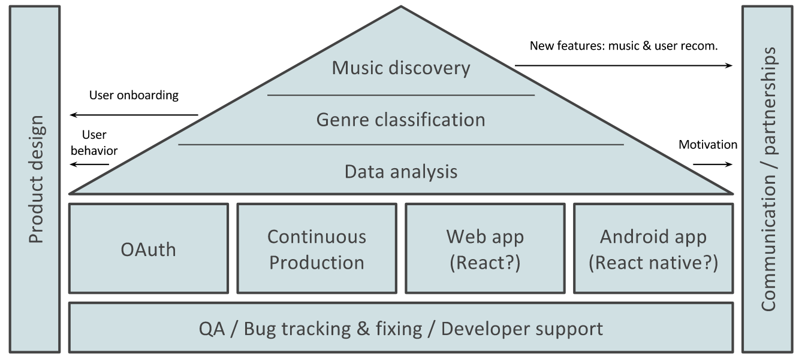

<!-- from [The Future of Openwhyd](https://medium.com/openwhyd/the-future-of-openwhyd-9a39e0839ac3) -->

# Openwhyd Roadmap

This document outlines the development plan from a high level and will be updated as progress is made towards Openwhyd version 2.0.

Everything contained in this document is in draft form and subject to change at any time and provided for information purposes only. The information is provided "as is" with no representations or warranties, express or implied.

## A bit of context

Openwhyd is a free and independent platform that enables users to create playlists of songs from several music streaming sources (e.g. Youtube, Soundcloud, Bandcamp, Deezer…), to share them, and to discover hidden gems hand-picked by our community of music lovers.

The development of this platform started in 2012 by the Parisian start-up company Whyd. During summer of 2016, Whyd offered the platform to its community of users, in order to focus on the development of their new product. With their blessing, Adrien Joly took the responsibility of turning Whyd’s ex-product into an open-source project, re-baptised “Openwhyd.”

Today, Openwhyd is maintained by volunteers on Github, coordinated by Adrien Joly, and hosting bills are covered by donations from our users.

Read more about [the story of Openwhyd](https://medium.com/openwhyd/music-amongst-other-topics-a4f41657d6d?source=collection_home---6------4----------------).

## Openwhyd v2.0

### Opportunities for improvement

Some users and contributors expressed their frustration on a few recurring topics.

Examples:

- Many are waiting for an Android app;
- Several users reported that the iPhone app is broken;
- The look and feel could be more modern, especially on the player that can be embedded on external websites;
- “Openwhyd” is quite a weird and unattractive name for newcomers;
- Music discovery is mostly done by manually exploring profiles;
- It’s still hard for developers to help us improve Openwhyd and fix bugs;
- Last but not least, it’s hard for developers to create alternative clients that connect to our API, while making sure that all existing features will be working.

Many of those issues are caused by technical debt and vintage development practices from its start-up years (2012–2014).

### Proposed vision for Openwhyd 2.0

For users, it’s important that Openwhyd becomes more attractive, easy and fun to use. From various mobile devices: iPhones, Android phones, and tablets. Music discovery should be made easier thanks to editorial content (e.g. blogs, interviews…), the possibility to join genre-centred groups, and/or personalised discovery features. (e.g. based on machine learning.) Also, why not think of a new brand identity!

Our partners (e.g. festivals, music venues, clubs and magazines that embed Openwhyd playlists onto their own website to publish their programme) would benefit from a better design and customisation options for our embedded player. We also imagine that some of our partners could contribute to sustaining Openwhyd financially, e.g. by providing a more seamless integration into their websites.

### Proposed technical directions for Openwhyd 2.0

As [suggested by Serdar](https://github.com/openwhyd/openwhyd/issues/101): before starting to add new features and/or clients (e.g. Android app), we need to consolidate the foundations of the current version. (e.g. bug fixing, documentation, automated tests)

Here's list of proposed directions to modernise Openwhyd's technical architecture, and to ease contributions from developers who want to join our effort:

- Move towards a modular architecture in which the API is separated from our web application; (jQuery-based front-end)
- A pure API server with 3rd-party authentication (e.g. OAuth), so that any developer can build their own Openwhyd app and allow their users to access their account from those apps.
- A progressive re-design of Openwhyd’s front-end, implemented using a modern component-based technology stack (e.g. React or Vue.js) and connecting to the new API server.
- Finally, move from continuous integration (i.e. automated tests are run to check the quality of all contributions) to continuous production, so that any contributor can have their changes immediately visible on openwhyd.org, without requiring any validation from me.

### Proposed architecture and projects for Openwhyd 2.0

Here's an overview of the resulting architecture:

And here's a diagram showing a wider range of projects to be worked on towards Openwhyd version 2.0:

You'll find information on how to contribute / support this effort, in [the corresponding section of README](https://github.com/openwhyd/openwhyd#support-openwhyd).

Feel free to file issues on this repository if you have questions, concerns, or suggestions.

## Openwhyd v1.0 (done)

Openwhyd used to be called "whyd" (hosted at whyd.com), and was the main product of the start-up company that developed it between 2012 and 2015. Read more about [the story of Openwhyd](https://medium.com/openwhyd/music-amongst-other-topics-a4f41657d6d?source=collection_home---6------4----------------) and the [release of Openwhyd 1.0 (open-source)](https://medium.com/openwhyd/openwhyd-has-become-a-mature-project-releasing-v1-0-92a398f99c75?source=collection_home---6------2----------------).

For its transformation into an open-source project, Openwhyd's technical infrastructure had to be reworked. Become more mature, robust and accessible to contributors.

To reach version 1.0, contributors have given dozens of hours of their spare time to:

- Write **automated tests** to make sure that Openwhyd’s features keep working as expected after each contribution to its source code;
- Setup **continuous integration**, so that those tests are run automatically;
- Remove deprecated modules to prevent **security holes**;
- Fix **bugs** related to playback and detection of tracks from external streaming platforms (e.g. Youtube), and new sign-ups;
- Improve the relevance and speed of **search results**, thanks to our partner: Algolia;
- And **help junior volunteers** along their first contribution to Openwhyd’s source code.

Here's the resulting architecture:

Read more on the [version release](https://github.com/openwhyd/openwhyd/releases/tag/v1.0).
