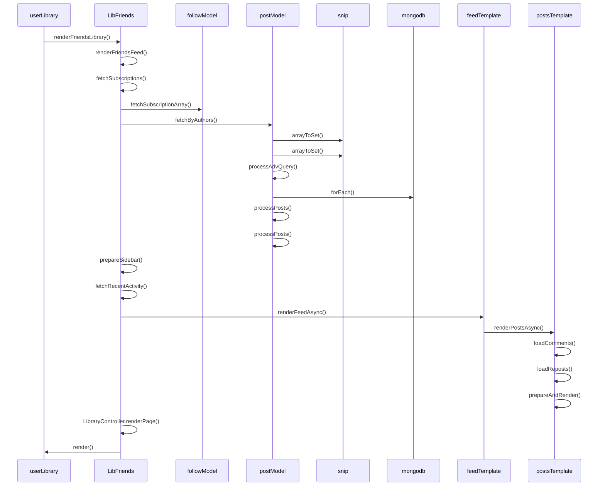

# Fetching and rendering a user's home feed

## Call tree

Here's the flow that renders a user's home feed:

- `app.route` says `GET / -> controllers.userLibrary` => controller is in `app/controllers/userLibrary.js`
- `userLibrary.js` controller jumps to `renderFriendsLibrary()`, in `app/controllers/LibFriends.js`
  - calls `renderFriendsFeed()`
    - calls `fetchSubscriptions()`
      - calls `followModel.fetchSubscriptionArray()` + adds user's id to the list
    - calls `postModel.fetchByAuthors()`
      - calls `snip.arrayToSet()`
        - calls `array.reduce()` with a destructured object, since https://github.com/openwhyd/openwhyd/pull/666/files#diff-7015e7bd64325d430e1608dd2b671c37cf36f350fc10f33d7a1b9bd229e784cbR233
      - calls `processAdvQuery()`, to build mongodb options
      - fetches posts from subscriptions
      - calls `processPosts()`, to ensure each post has a `lov` property
    - calls `prepareSidebar()`
      - calls `fetchRecentActivity()`
    - calls `feedTemplate.renderFeedAsync()`
      - calls `postsTemplate.renderPostsAsync()`
        - calls `loadComments()`
        - calls `loadReposts()`
        - calls `prepareAndRender()`
  - calls `LibraryController.renderPage`
    - calls `render` of `userLibrary.js`

## Sequence diagram

