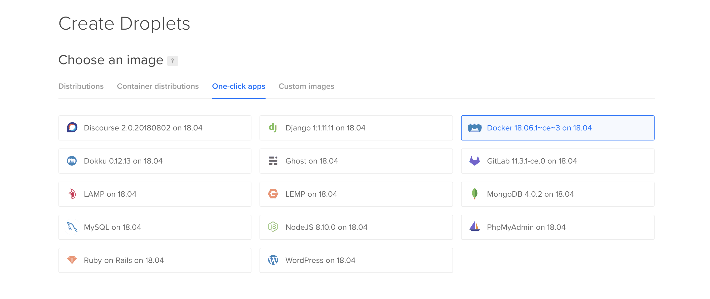

# Deploying to Digital Ocean

Let's start off with creating a droplet, you will be utilizing Digital Ocean's Docker one click app. This creates a droplet that comes pre-installed with Docker.



Now set your desired droplet size, region, and other additional settings. Don't forget to add in your ssh key. You can take a look at this [guide](https://www.digitalocean.com/docs/droplets/how-to/add-ssh-keys/) if you don't have an ssh key yet.

Next step is to setup a [new user in your droplet](https://www.digitalocean.com/community/tutorials/initial-server-setup-with-ubuntu-18-04). The new user is for you to have lesser privileges in accessing your droplet, as the root user has very broad privileges and it could be potentially dangerous.

Now that you have another user, proceed to setting up Openwhyd. Open the `docker-compose-deploy.yml` file and set the necessary environment variables. After this, you now need to copy this file to your droplet. You will be using [scp](https://linux.die.net/man/1/scp). Change the current directory into the project directory and then run.

```
$ scp ./docker-compose-deploy.yml username@your-droplet-ip:~/docker-compose.yml
```

(Remember to replace `your-droplet-ip` with the actual IP address of your droplet.)

Next is to `ssh` into your droplet.

```
$ ssh username@your-droplet-ip
```

You should now be connected to your droplet through the `ssh` protocol.

Change the current directory into the home directory.

```
$ cd $HOME
```

Double check if the `docker-compose` file is there.

```
$ ls -l
```

Then run the containers.

```
$ sudo docker compose up -d
```

This command will first pull the images from the registry and then run the containers in the background.

If everything goes smoothly, you should now see Openwhyd up and running by visiting `your-droplet-ip:8080` in your browser.

You now have successfully deployed Openwhyd into your droplet.
