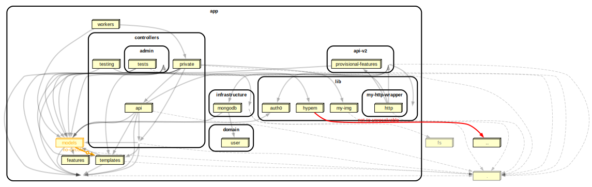

# Dependency analysis generated by `scripts/code-analysis/report.sh`

## Forbidden dependency check - results

### :chart_with_upwards_trend: Summary

**128** modules&nbsp;&nbsp;&nbsp;&nbsp;**336** dependencies&nbsp;&nbsp;&nbsp;&nbsp;**1** errors&nbsp;&nbsp;&nbsp;&nbsp;**18** warnings&nbsp;&nbsp;&nbsp;&nbsp;**0** informational&nbsp;&nbsp;&nbsp;&nbsp;**0** ignored

|rule|violations|ignored|explanation
|:---|:---:|:---:|:---|
|:warning:&nbsp;_no-circular_|**12**|**0**|This dependency is part of a circular relationship. You might want to revise your solution (i.e. use dependency inversion, make sure the modules have a single responsibility) |
|:warning:&nbsp;_no-orphans_|**6**|**0**|This is an orphan module - it's likely not used (anymore?). Either use it or remove it. If it's logical this module is an orphan (i.e. it's a config file), add an exception for it in your dependency-cruiser configuration. By default this rule does not scrutinize dot-files (e.g. .eslintrc.js), TypeScript declaration files (.d.ts), tsconfig.json and some of the babel and webpack configs.|
|:exclamation:&nbsp;_not-to-unresolvable_|**1**|**0**|This module depends on a module that cannot be found ('resolved to disk'). If it's an npm module: add it to your package.json. In all other cases you likely already know what to do.|

### :fire: All violations

Violations found - click to expand

|violated rule|module|to|
|:---|:---|:---|
|:exclamation:&nbsp;_not-to-unresolvable_|app/lib/hypem/index.js|../get|
|:warning:&nbsp;_no-circular_|app/models/activity.js|app/models/follow.js &rightarrow; app/models/mongodb.js &rightarrow; app/models/user.js &rightarrow; app/models/post.js &rightarrow; app/models/activity.js|
|:warning:&nbsp;_no-circular_|app/models/activity.js|app/models/mongodb.js &rightarrow; app/models/user.js &rightarrow; app/models/post.js &rightarrow; app/models/activity.js|
|:warning:&nbsp;_no-circular_|app/models/activity.js|app/models/post.js &rightarrow; app/models/activity.js|
|:warning:&nbsp;_no-circular_|app/models/email.js|app/models/user.js &rightarrow; app/models/email.js|
|:warning:&nbsp;_no-circular_|app/models/mongodb.js|app/models/user.js &rightarrow; app/models/mongodb.js|
|:warning:&nbsp;_no-circular_|app/models/notif.js|app/models/mongodb.js &rightarrow; app/models/user.js &rightarrow; app/models/post.js &rightarrow; app/models/notif.js|
|:warning:&nbsp;_no-circular_|app/models/notif.js|app/models/notifEmails.js &rightarrow; app/models/email.js &rightarrow; app/models/user.js &rightarrow; app/models/post.js &rightarrow; app/models/notif.js|
|:warning:&nbsp;_no-circular_|app/models/notif.js|app/models/user.js &rightarrow; app/models/post.js &rightarrow; app/models/notif.js|
|:warning:&nbsp;_no-circular_|app/models/notifEmails.js|app/templates/notif.js &rightarrow; app/models/featuredUsers.js &rightarrow; app/models/user.js &rightarrow; app/models/post.js &rightarrow; app/models/notif.js &rightarrow; app/models/notifEmails.js|
|:warning:&nbsp;_no-circular_|app/models/post.js|app/models/mongodb.js &rightarrow; app/models/user.js &rightarrow; app/models/post.js|
|:warning:&nbsp;_no-circular_|app/models/post.js|app/models/user.js &rightarrow; app/models/post.js|
|:warning:&nbsp;_no-circular_|app/models/track.js|app/models/mongodb.js &rightarrow; app/models/user.js &rightarrow; app/models/post.js &rightarrow; app/models/notif.js &rightarrow; app/models/notifEmails.js &rightarrow; app/templates/notif.js &rightarrow; app/models/track.js|
|:warning:&nbsp;_no-orphans_|app/controllers/admin/testUpload.js||
|:warning:&nbsp;_no-orphans_|app/controllers/iframe.js||
|:warning:&nbsp;_no-orphans_|app/controllers/now.js||
|:warning:&nbsp;_no-orphans_|app/controllers/subdir.js||
|:warning:&nbsp;_no-orphans_|app/domain/OpenWhydFeatures.js||
|:warning:&nbsp;_no-orphans_|app/models/htmlDom.js||

---
[dependency-cruiser@16.10.2](https://www.github.com/sverweij/dependency-cruiser) / 2025-05-29T12:38:19.591Z

## DDot graph

## Archi graph

## Full dependency graph

## Full dependency graph by arkit

