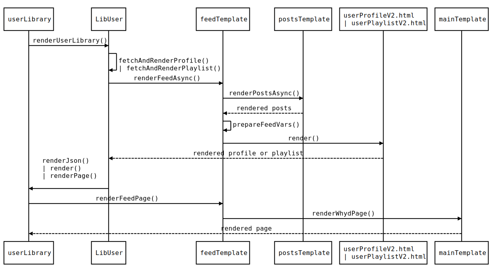

[→](08-pièges.md)

<!--
🔍 Observations:

- `userProfileV2.html` définit bouton "load more"

- ... sélectionné et populé par `controllers/LibUser.js`

- ... rendu (complet ou pas) par `templates/feed.js`

- ... en fonction de `header` et `options.after`
-->
